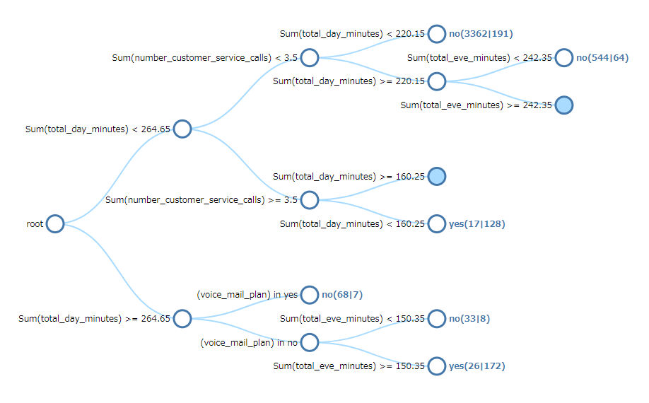
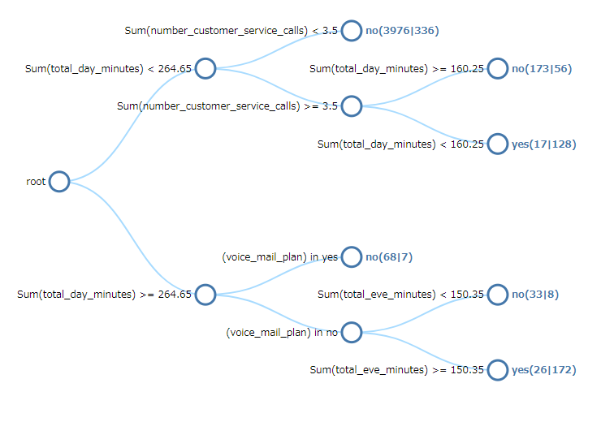

# Decision tree
Plot classification tree  

## Screenshot

## Prerequisite R packages
 * rpart
 * d3r
 * partykit
 * jsonlite

## Used R command
 * [rpart](https://www.rdocumentation.org/packages/rpart/versions/4.1-11/topics/rpart)

## Caution

## Usage
  1. Place [Advanced Analytics Toolbox] extension on a sheet and select [Classification] > [Decision tree] for [Analysis Type]
  2. Select dimensions and measures
    * Dimension: A field uniquely identifies each record (ex: ID, Code)
    * Measure 1: Response variable
    * Measure 2-: Predictor variables

## Options
 * Method - "Class" for a classification tree or "Anova" for a regression tree
 * Minimum split - The minimum number of observations that must exist in a node in order for a split to be attempted.
 * Minimum bucket - The minimum number of observations in any terminal <leaf> node.
 * Complexity parameter(cp) - Any split that does not decrease the overall lack of fit by a factor of cp is not attempted.
 * Max depth - The maximum depth of any node of the final tree, with the root node counted as depth 0
 * Default Collapse Level - The default collapse level of the tree.
 * Display results on all nodes - When turned on, the results are displayed on all nodes. When turned off, the results are displayed only on the leaf nodes.
 * Split into training and test datasets - When turned on, the input data is split into training and test datasets.
 * Treat first N% records as training dataset - When "Split into training and test datasets" is turned on, the percentage of the first records specified here is treated as training data, and the rest is treated as test data.

## Example1 - Customer Churn Data
  1. Download the following sample file.
    * churn ( [Download file](./data/churn.xlsx) | [Description on the dataset](https://rdrr.io/cran/C50/man/churn.html) )  
  2. Load the downloaded file into a new Qlik Sense app.
  3. Place [Advanced Analytics Toolbox] extension on a sheet and select [Classification] > [Decision tree] for [Analysis Type]
  4. Select [ID] for a dimension.
  5. We are adding t datasets for clustering. Press [+] button to add measure button, and select the following fields for the first measure as a response variable to be predicted. The item "churn" contains categorical values ("yes" and "no") no numerical values, so make sure that you selected "(churn)", not "Sum(churn)".

    * (churn)

  6. Add the following measures as the predictor variables. The item "voice_mail_plan" contains categorical values ("yes" and "no") no numerical values, so make sure that you selected "(voice_mail_plan)", not "Sum(voice_mail_plan)".

    * Sum(number_customer_service_calls)
    * Sum(total_day_minutes)
    * Sum(total_eve_minutes)
    * (voice_mail_plan)

  7. A decision tree is displayed.
  

  8. Next, open [Analysis Settings] on the property panel and input 3 into [Max depth]. The depth of the tree node is changed to 3.
  

## Example2 - Iris
  1. Download the following sample file.
    * Iris ( [Download file](./data/Iris.xlsx) | [Description on the dataset](https://archive.ics.uci.edu/ml/datasets/iris) )  
  2. Load the downloaded file into a new Qlik Sense app.
  3. Place [Advanced Analytics Toolbox] extension on a sheet and select [Classification] > [Decision tree] for [Analysis Type]
  4. Select [ID] for a dimension.
  5. We are adding 5 datasets for clustering. Press [+] button to add measure button, and select the following fields for the first measure as a response variable to be predicted. The item "churn" contains categorical values ("setosa", "versicolor" and "virginica") no numerical values, so make sure that you selected "([Species])", not "Sum([Species])".

    * ([Species])

  6. Add the following measures as the predictor variables.

    * Sum(Petal.Length)
    * Sum(Petal.Width)
    * Sum(Sepal.Length)
    * Sum(Sepal.Width)
  7. A decision tree is displayed.

  
