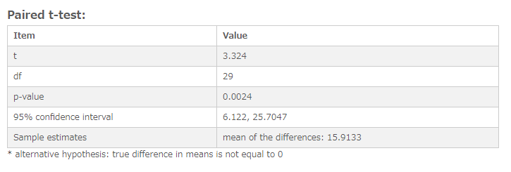

# T-Test
Performs T-Test to examine whether the means of two samples are statistically different from each other. There are following types of T-Test:
  * Two sample T-Test - Performs test to examine if two independent samples' means are equal assuming that their variance are equal
  * Welch two sample T-Test  - Performs test to examine if two independent samples' means are equal assuming that their variance are not equal
  * Paired T-Test - Performs test to examine if two paired samples' means are equal

## Screenshot

## Prerequisite R packages
 * jsonlite

## Used R command
 * [t.test](https://www.rdocumentation.org/packages/stats/versions/3.4.1/topics/t.test)

## Caution
 * Null values passed to R are treated as NaN and they are excluded in T-Test computation.
 * Sum() might pass 0 to R when you expect Null to be passed and you might receive unintended results especially when data includes Null values or when you use set analysis expressions to filter data. (In the following example1, an erroneous result is displayed when you used Sum() instead of Only().) It is recommended to check expression and data on a table.
 * The number of records included in the samples need to be the same when performing paired T-Test.
 * Number formatting settings on measure properties are ignored.

## Usage
  1. Place [Advanced Analytics Toolbox] extension on a sheet and select [Statistical hypothesis testing] > [T-Test] for [Analysis Type]
  2. Select dimensions and measures
    * Dimension: Time series field (ex: Year, YearMonth, Date, Sequential ID, etc)
    * Measure1: A field contains the first sample dataset
    * Measure2: A field contains the second sample dataset
## Options

## Example1 - Motor Trend Car Road Tests
The Motor trend car road tests dataset includes fuel consumption of different types of cars and 10 aspects of automobile design. The dataset includes the following columns:
  * am - the transmission type of the automobile model (0 = automatic, 1 = manual)
  * mpg - gas mileage data of the automobile model

In this example, we seek to evaluate if there is a difference in the mean of the gas mileage between manual and automatic transmissions using two sample t-test.

1. Download the following sample file.
  * mtcars ( [Download file](./data/mtcars.xlsx) | [Description on the dataset](https://www.rdocumentation.org/packages/datasets/versions/3.4.1/topics/mtcars) )  
2. Load the downloaded file into a new Qlik Sense app.
3. Place [Advanced Analytics Toolbox] extension on a sheet and select [Statistical hypothesis testing] > [T-Test - Welch two sample T-Test] for [Analysis Type]
4. Select [ID] for a dimension.
5. From the property panel on the right-side, add two measures with the following expressions:

    `Only({<am={0}>} mpg)`    
    `Only({<am={1}>} mpg)`

6. The p-value is 0.0014, so the null hypothesis is rejected at 0.05 significance level, which indicates that there is a difference in means between two datasets.

## Example2 - Barley yield in years 1931 and 1932
The dataset contains the barley yield in years 1931 and 1932 of the same field. In this example, we evaluate the difference between the mean barley yields between years 1931(Y1) and 1932(Y2).

1. Download the following sample file.
  * immer ( [Download file](./data/immer.xlsx) | [Description on the dataset](https://www.rdocumentation.org/packages/MASS/versions/7.3-47/topics/immer) )  
2. Load the downloaded file into a new Qlik Sense app.
3. Place [Advanced Analytics Toolbox] extension on a sheet and select [Statistical hypothesis testing] > [T-Test - Paired T-Test] for [Analysis Type]
4. Select [name] for a dimension and Sum([Y1]) and Sum([Y2]) for measures.
5. The p-value is 0.0024, so the null hypothesis is rejected at 0.05 significance level, which indicates that there is a difference in means between two datasets.

